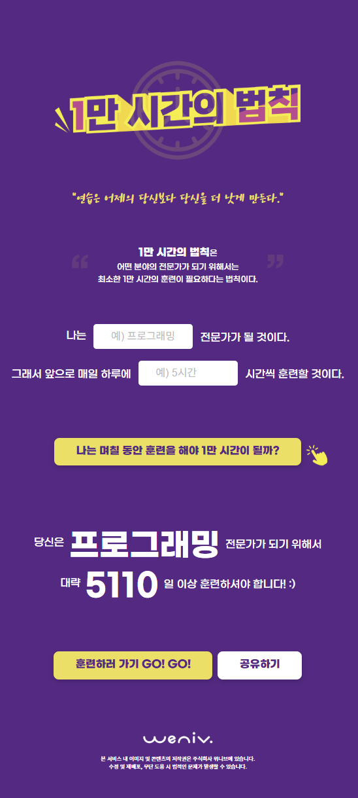
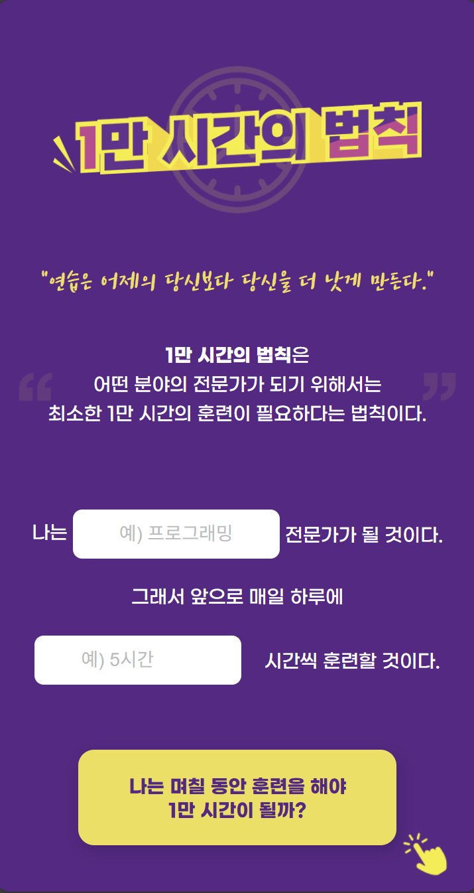
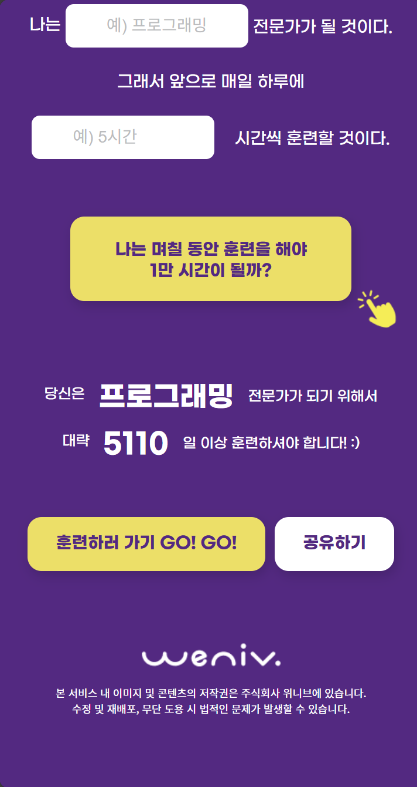
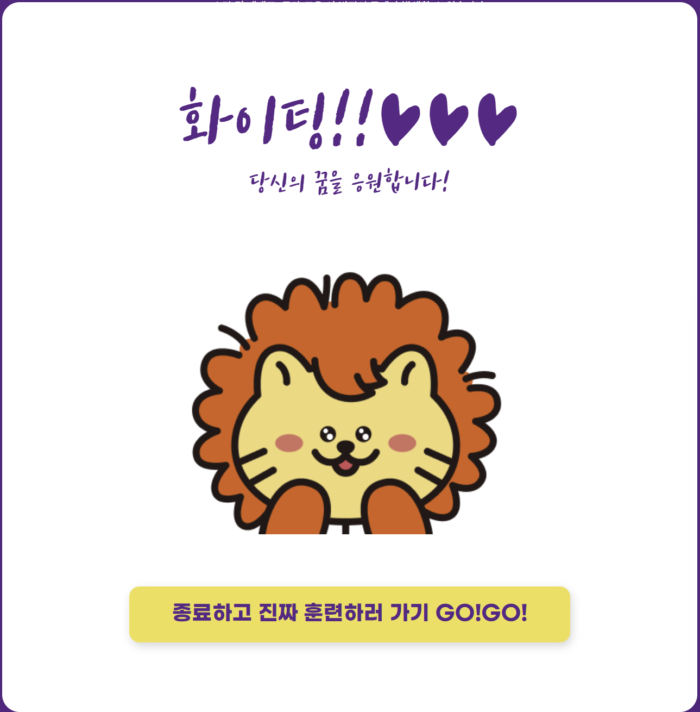
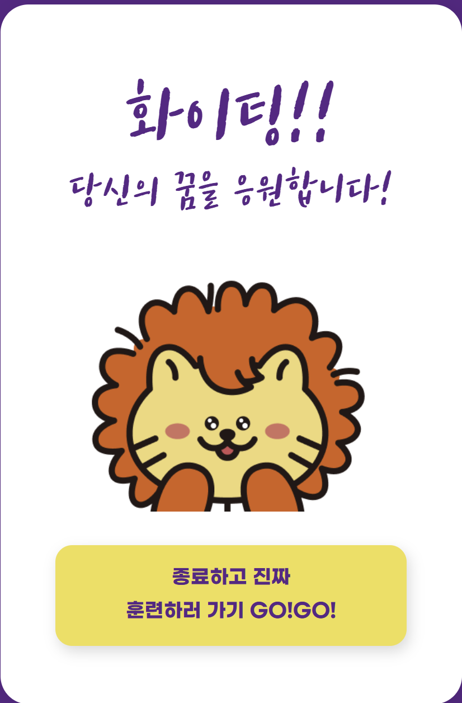

# 1만 시간의 법칙 (The 10,000 Hours Rule)

## 1. 프로젝트 개요

### 1.1 목표
- **HTML/CSS 실습**: 시맨틱 태그를 활용한 마크업과 CSS를 이용한 스타일링 능력을 향상합니다.
- **반응형 웹 구현**: 미디어 쿼리를 사용하여 데스크탑과 모바일 환경 모두에서 깨지지 않는 레이아웃을 구현합니다.
- **웹 접근성 고려**: `ir` 기법(이미지 대체 텍스트) 등을 활용하여 웹 접근성을 고려한 마크업을 수행합니다.

### 1.2 기능 (UI 중심)
- **메인 화면**: 타이틀, 명언, 입력 폼(분야, 시간)이 배치된 랜딩 페이지 구현
- **결과 섹션**: 훈련 시간을 계산한 결과가 보여질 영역 디자인 (현재는 정적 데이터 표시)
- **모달 팝업**: 응원 메시지를 담은 오버레이 팝업 디자인 구현 (추후 JS로 제어 예정)
- **반응형 레이아웃**: 
  - Desktop: 최대 771px 너비의 중앙 정렬 레이아웃
  - Mobile: 771px 이하에서 일부 요소들이 세로로 배치되고 크기가 유동적으로 변하는 레이아웃

### 1.3 팀 구성 & 개발 기간
- **개발 기간**: 2025.12.05 ~ 2025.12.10 (6일)
- **팀 구성**: 1인 개발 (Personal Project)

<table>
  <tr>
    <th align="center">Name</th>
    <th align="center">Role</th>
    <th align="center">Github</th>
  </tr>
  <tr>
    <td align="center"><strong>강민기</strong></td>
    <td align="center">Frontend Developer<br>(Publishing)</td>
    <td align="center">
        <a href="https://github.com/magnesium03">
            
        </a>
    </td>
  </tr>
</table>

## 2. 개발 환경 및 배포 URL

### 2.1 개발 환경
- **IDE**: Visual Studio Code
- **Language**: HTML5, CSS3
- **Version Control**: Git, GitHub

### 2.2 배포 URL
- **서비스 바로가기**: https://magnesium03.github.io/first_mini_project1/
- **테스트**: 별도의 설치 없이 웹 브라우저를 통해 접속 가능합니다.

## 3. UI/UX 및 디자인

### 3.1 와이어프레임 및 화면 구성

- Desktop ver.


- Mobile ver.



- Desktop View 팝업창


- Mobile View 팝업창


## 🖥️ 화면 설계 (UI Design)

### 1. 메인 웹페이지
<table>
  <tr>
    <th align="center">구분</th>
    <th align="center">데스크탑 (Desktop)</th>
    <th align="center">모바일 (Mobile)</th>
  </tr>
  <tr>
    <td align="center"><strong>전체 화면</strong></td>
    <td align="center">
      <br>
      <sub>데스크탑 메인</sub>
    </td>
    <td align="center">
      
      
      <br>
      <sub>모바일 메인 (스크롤)</sub>
    </td>
  </tr>
</table>

### 2. 팝업창 (Popup / Modal)
<table>
  <tr>
    <th align="center">구분</th>
    <th align="center">데스크탑 (Desktop)</th>
    <th align="center">모바일 (Mobile)</th>
  </tr>
  <tr>
    <td align="center"><strong>팝업 화면</strong></td>
    <td align="center">
      
    </td>
    <td align="center">
      
    </td>
  </tr>
</table>

## 4. 핵심 코드 및 배운 점

### 4.1 CSS 변수(Variables) 활용
- 색상 등 반복되는 값을 `:root`에 변수로 선언하여 유지보수성을 높였습니다.
```css
:root {
    --letter-color: #FFFFFF;
    --btn-color: #F5DF4D;
    --bg-color: #5B2386;
    --input-color: #BABCBE;
    --shadow-color: rgba(0, 0, 0, 0.15);
}
```

### 4.2 반응형 미디어 쿼리 (Media Queries)
- `max-width: 771px`을 기준으로 모바일 화면을 대응했습니다.
- 플렉스 박스의 방향(`flex-direction`)을 변경하거나 요소 간 간격 및 폰트 크기를 조절하여 가독성을 확보했습니다.
- 예시)
```css
@media (max-width:771px) {
    .container {
        width: 360px;
        margin-top: 0;
    }
    .phr2-p2 {
        flex-direction: column; /* 가로 배치 -> 세로 배치 */
        gap: 19px;
    }
}
```

### 4.3 폰트 및 웹 접근성
- Web Font: reset.css에서 @font-face를 사용해 프로젝트 디자인에서 지정한 폰트를 로드했습니다.

- IR 기법: 모든 img 태그에 의미있는 대체 텍스트인 alt를 제공하여 이미지가 뜨지 않거나 보이지 않더라도 이미지의 의미를 전달할 수 있습니다.

## 5. 추후 개선 사항 (Future Works)

- **JavaScript** 학습 및 기능 구현:

현재는 HTML/CSS로 화면만 구현된 상태입니다.

추후 JavaScript를 학습하여 실제 입력값에 따라 훈련 일수를 계산하는 로직을 추가할 예정입니다.

- 버튼 클릭 시 **모달창**이 뜨고 닫히는 기능을 구현할 예정입니다.

- **SNS 공유 기능**: 결과 화면을 친구들에게 공유할 수 있는 기능을 추가할 예정입니다.

## 6. 개발하며 느낀점
- HTML 태그의 구조적 의미(Semantic Web)에 대해 고민하며 마크업을 진행했습니다.

- CSS Flexbox를 활용한 중앙 정렬과 레이아웃 배치에 대해 익숙해졌습니다.

- 아직 동적인 기능(계산, 클릭 이벤트 등)은 구현하지 못했지만, 화면이 의도한 대로 디자인되어 배포된 것을 보며 성취감을 느꼈습니다.